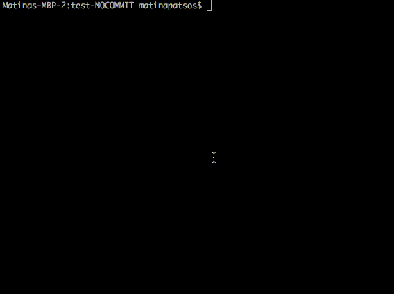

# Project 1 Description: Hangman

**Due November 11, 2019**

For your first project, you will be creating a text based Hangman game with Node.js. Hangman is a word guessing game where the computer picks a word or phrase. A player must guess what the word or phrase is, letter-by-letter. If she make too many gueses, the hangman is "hung" and she will lose.

If you are not familar with the game, you can [watch this video](https://www.youtube.com/watch?v=j-pBzBvJVKc) and [play this example game](https://www.ego4u.com/en/chill-out/games/hangman?0).



For your game, you will have multiple _rounds_. Each round will begin with the computer picking a word at random. The player will then make a series of guesses. The round will end when the player either guesses the entire word or he guesses more than six letters. The computer will be keeping track of the number rounds the player has won and the total number of rounds played. It will display the results after each round ends.

## Getting Started

You will need to [create a new public Github repository](https://help.github.com/en/articles/create-a-repo) for this project. Name your new repository "hangman". Once the new repository is set up, [clone the Github repository](https://help.github.com/en/articles/cloning-a-repository). Then type `cd hangman` in either your terminal or Git Bash.

Inside this folder, create a new file called _package.json_. Inside the file, copy and paste the following. Replace where is says `<YOUR NAME>` with your name and `<YOUR USERNAME>` with your Github username.

```json
{
  "name": "hangman",
  "version": "1.0.0",
  "engine": {
    "node": "12.10.0"
  },
  "main": "index.js",
  "author": "<YOUR NAME>",
  "repository": {
    "type": "git",
    "url": "git+https://github.com/<YOUR USERNAME>/hangman.git"
  }
}
```

For this project, you will need to be able to read command line input. We suggest that you use the _[readline-sync](https://www.npmjs.com/package/readline-sync)_ library, which you can install by running this in your terminal:

```shell
npm install --save readline-sync
```

However, you are welcome to use Node's built in _[readline](https://nodejs.org/api/readline.html)_ module or another library of your choice.

Inside the _JavaScriptFundmentals2019_ folder, we have created a word bank file for you. This is the list of all the possible words that the computer can pick at random. Copy the _projects/01-hangman/word-bank.json_ file and paste it into your new repository. It should still be called _word-bank.json_.

Create a new file called _index.js_. This is the main file for your first project. You will be writing your code in this file. The first two lines should look like this:

```javascript
const prompt = require("readline-sync");
const wordBank = require("./word-bank.json");
```

The first line will include the _readline-sync_ library. The second will import all the words from our word bank into an array.

You should also create a _README.md_ file, which you should write in [Markdown](https://github.com/adam-p/markdown-here/wiki/Markdown-Cheatsheet). It should explain what the project is and how to play the game. You can find [a sample README here](https://gist.github.com/PurpleBooth/109311bb0361f32d87a2).

## Playing the Game

In Visual Studio Code, open your terminal. To start the game, run `node .` To end the game, you must press `ctrl + c`.

You will display messsages to the user with `console.log`. For example:

```javascript
console.log("\nWelcome to Hangman!\nPress ctrl+c to stop\n");
```

The new line character (`\n`) is like pressing "enter" in text editors like Microsoft Word or Visual Studio Code. Use this to make your text output easier to read.

The player will guess a letter over the command line. She will type a single letter and hit `enter`. To get input from the player with the _readline-sync_ library, you will do something like this:

```javascript
const letter = prompt.question("Please guess a letter: ");
```

[You can read the full _readline-sync_ documentation here](https://www.npmjs.com/package/readline-sync).

## Project Requirements and Grading

You will either be given a passing or failing grade. You must meet all of the following application, UI and coding requirements in order to pass:

### Application Requirements

- Your application must start over the command line with `node .`
- Your application should not crash at any point.

### UI Requirements

- Use words from a word bank (_word-bank.json_). For each round, a word must be chosen at random.
- The game should have multiple rounds. Each round should end after either the player guesses the entire word or six incorrect guesses.
- After each round, display the answer (the word the computer picked) and the results. The results should be how many games the player won out of the total games played.
- Display visual feedback in the guessing portion of the game. Show which letter guesses are correct, what letters in what positions are still remaining, what letters the player has guessed and how many guesses are left.
- Only accept letters _(abcdefghijklmnopqrstuvwxyzABCDEFGHIJKLMNOPQRSTUVWXYZ)_. If a player guesses a special character, it should not count as a guess.
- Your game must be case insentive. This means that when the player guesses a letter, the computer will treat lower case and upper case versions of a letter as the same character.
- Only accept one letter at a time. If the player enters more than one letter, only accept the first letter and ignore the rest. For example, if a player types "as", you should treat it like "a".
- Repeat guesses should not count against the player. For example, if the player has three guesses left, and he has already guessed the letter "a", he should still have three guesses left when he guesses "a" second time.
- The game will keep on going until the user presses `ctrl + c` to stop. You must include this in your instructions before each round.
- Please make sure your game text is easily readable. Use the new line characters (`\n`) where needed.

### Coding Requirements

- Your code must contain at least one high order function with arrays (e.g. _Array.forEach_, _Array.map_, _Array.find_, _Array.filter_ and _Array.reduce_).
- You must have at least one arrow function (but we encourage you to use it more than that).
- It will be an **automatic failure** if you use _var_.

### Quality Requirements

While you will not fail if you do not meet these quality requirements, we will ask you to resubmit your work if it is not up to a professional standard. One of the goals of this project is to help you build a portfolio. Just like an interviewer will judge you on your attire, employers will judge you on the neatness of your code.

- You should have a README.md written in Markdown. It should explain what your project is and how to start, stop and play the game.
- You must not leave any debugging statements in your code. This means when you commit your code, remove any `console.log` statements that are not intended for the user to see.
- Choose descriptive and specific variable, constant and function names. For example, do not call the word that your computer picks at random _str_.
- Add comments to your code that is difficult to understand.
- Only have actual comments within comment tags. Do not commit code that you commented out for debugging purposes.
- Use proper indentation. (Prettier will take care of this).

### Hints

- If you need to cheat so that you can develop and test a winning round, temporarily make your word bank a single word you know. For example, you can do this (but be sure to undo when you commit your code):

```javascript
const prompt = require("readline-sync");
// const wordBank = require("./word-bank.json");
const wordBank = ["win"];
```

- I completed this project with a _while_ loop.
- You can pick a random word with _Math.random_.
- Here is one way that you can test and see if a string contains only letters:

```javascript
if (/[a-zA-Z]/.test(userInput)) {
  // Do something in here
  console.log("This is a letter");
} else if (/[^a-zA-Z]/.test(userInput)) {
  // Do something here
  console.log("This is NOT a letter");
}
```

## Project Resubmission

You may resubmit this project again for a better grade. In order to resubmit, you must have made a valid attempt. (That is, and you must have followed all the steps in the _Getting Started_ documentation, your app must run, and you have started to meet some of the requirements). You have until the last day of class to resubmit your project.
