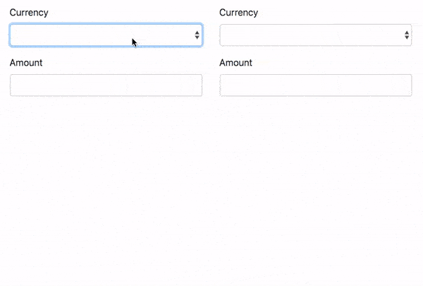

# Observer Pattern

Press `command+shift+v` on Mac or `ctrl+shift+v` on Windows to preview this in Visual Studio Code.

## Instructions

You will be creating a currency converter tool using the observer pattern.



The amounts should update when anything on the page changes (so that means both currency dropdowns and both amount textboxes). Changes on the left side should update the amount on the right side and vise versa.

You will be working inside the file _src/index.js_ only. You must use the observer pattern. I have completed some of it for you already, but if you would like, feel free to start from scratch.

## Getting Started

If you haven't already, please pull the latest changes:

```
git pull upstream master
```

In your terminal, navigate to this exercises folder and install all the dependencies. (You will only need to run the install command once).

```
cd exercises/13-observer-pattern
npm install
```

This project is using webpack. You can run the dev server with:

```
npm run start
```

(If that doesn't work, you can manually build with refreshing with `npm run build`. Within your browser, you will need to open the _index.html_ inside of _exercises/13-observer-pattern/public/_ .)

Press `ctrl+c` to quit webpack.
